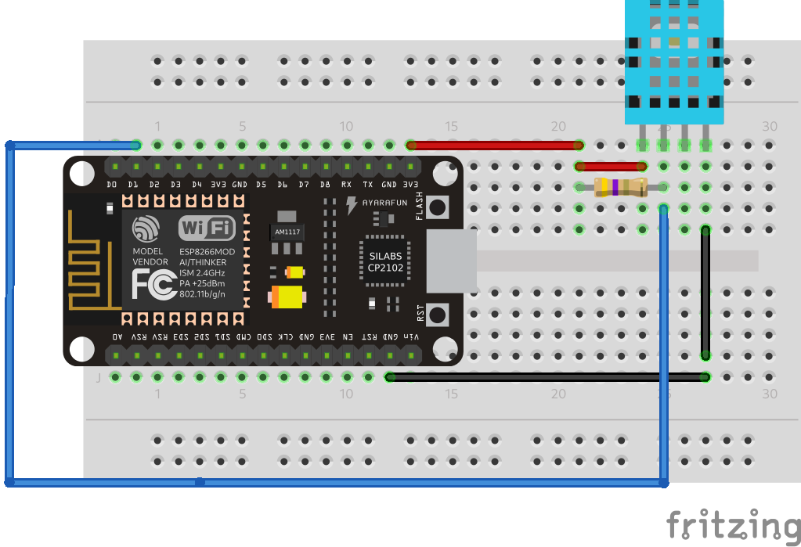

You can read this in [English (EN)](https://github.com/russibc/dht11/blob/main/README.md) or [Portuguese (PT-BR)](https://github.com/russibc/dht11/blob/main/README.pt.md).

# DHT11 Sensor Read for NodeMCU (ESP-12E)

  

 

## :warning: Before running the code, follow this steps

### Step 1: Include ESP8266 on library manager

Open `File` menu > `Preferences`.

On `Additional Boards Manager URLs` paste this link: 
`https://arduino.esp8266.com/stable/package_esp8266com_index.json`

### Step 2: Install ESP8266 board

Open `Tools` menu > `Board` > `Board Manager`.

Install version `2.7.4` of library `esp8266` by Esp8266 Community.

### Step 3: Select NodeMCU board

Open `Tools` menu > `Board` > `ESP8266 Boards`.

Select `NodeMCU 1.0 (ESP-12E Module)`.

### Step 4: Install libraries

Open `Sketch` menu > `Include Library` > `Manage Libraries`.

Find and install:
**DHT Sensor Library** and **Adafruit Unified Sensor** by Adafruit.
